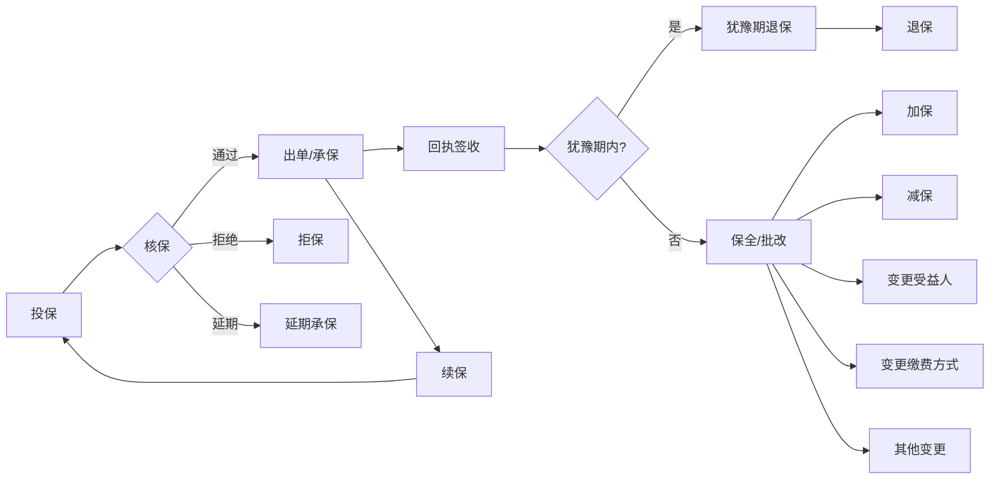
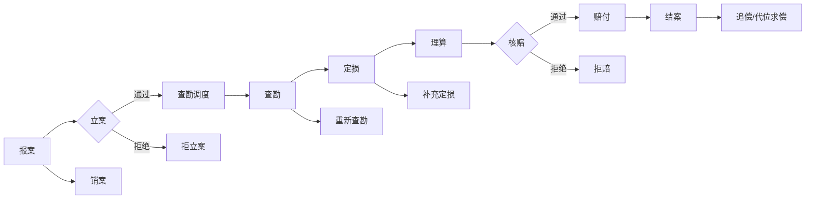
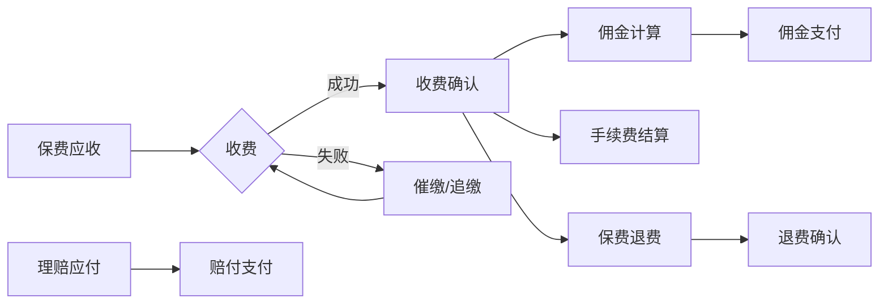
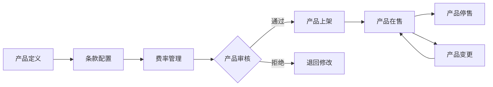
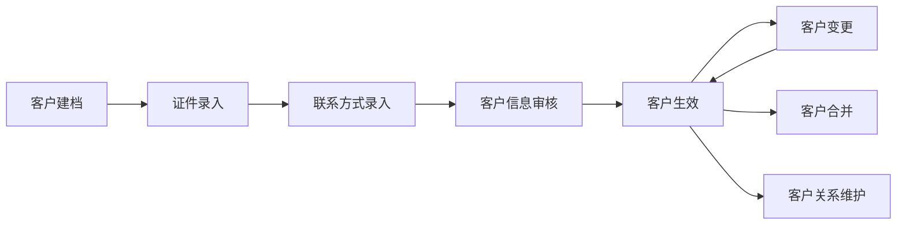

# 保险行业数仓建模参考示例

> 本文档为 AI 建模时的参考模板，用于辅助识别保险行业的业务过程、数据域和维度。实际建模时应以用户提供的 DDL 和采样数据为准。

---

## 一、典型业务板块与业务过程

### 1.1 承保板块



**涉及典型表：**
| 业务过程 | 典型表名 |
|---------|---------|
| 投保 | t_proposal, t_proposal_item, t_applicant |
| 核保 | t_underwrite, t_uw_decision, t_uw_rule |
| 出单 | t_policy, t_policy_item, t_insured |
| 批改/保全 | t_endorsement, t_endorsement_item |
| 退保 | t_surrender, t_cancel |
| 续保 | t_renewal, t_renewal_relation |

### 1.2 理赔板块



**涉及典型表：**
| 业务过程 | 典型表名 |
|---------|---------|
| 报案 | t_claim_report, t_claim_report_info |
| 立案 | t_claim_register, t_claim_case |
| 查勘 | t_survey, t_survey_dispatch, t_survey_report |
| 定损 | t_loss_assessment, t_damage_item |
| 理算 | t_claim_calculation, t_calc_detail |
| 核赔 | t_claim_approval, t_approval_flow |
| 赔付 | t_claim_payment, t_payment_detail |
| 结案 | t_claim_close, t_case_close |

### 1.3 收付费板块



**涉及典型表：**
| 业务过程 | 典型表名 |
|---------|---------|
| 保费收取 | t_premium_receive, t_premium_bill |
| 保费退费 | t_premium_refund, t_refund_detail |
| 佣金支付 | t_commission_calc, t_commission_pay |
| 手续费结算 | t_fee_settlement, t_fee_detail |

### 1.4 产品板块



**涉及典型表：**
| 业务过程 | 典型表名 |
|---------|---------|
| 产品定义 | t_product, t_product_info |
| 条款管理 | t_clause, t_clause_item |
| 费率管理 | t_rate_table, t_rate_factor |
| 产品上下架 | t_product_status, t_product_publish |

### 1.5 客户板块



**涉及典型表：**
| 业务过程 | 典型表名 |
|---------|---------|
| 客户建档 | t_customer, t_customer_base |
| 证件管理 | t_id_info, t_certificate |
| 联系方式 | t_contact_info, t_address |
| 客户合并 | t_customer_merge, t_merge_log |

### 1.6 销管板块

```
[渠道准入] → [代理人招募] → [代理人入职] → [业绩归属] → [考核] → [佣金方案]
                                                  ↓
                                            [代理人离职]
```

**涉及典型表：**
| 业务过程 | 典型表名 |
|---------|---------|
| 渠道管理 | t_channel, t_channel_agreement |
| 代理人管理 | t_agent, t_agent_cert |
| 业绩归属 | t_performance, t_performance_detail |
| 考核 | t_assessment, t_assessment_result |

### 1.7 再保板块

```
[合约分保] → [临时分保] → [摊回计算] → [再保账单] → [再保结算]
```

### 1.8 财务板块

```
[准备金计提] → [损益核算] → [科目记账] → [监管报表生成]
```

### 1.9 机构与人员板块

```
[机构设立] → [组织架构变更] → [人员岗位管理] → [机构撤销]
```

---

## 二、典型数据域划分

| 数据域 | 业务过程 | 核心实体 |
|-------|---------|---------|
| **承保域** | 投保、核保、出单、回执、批改（加保/减保/变更）、退保、续保 | 保单、投保单、批单 |
| **理赔域** | 报案、立案、查勘、定损、理算、核赔、赔付、结案、拒赔、追偿 | 理赔案件、赔案 |
| **收付费域** | 保费收取、保费退费、佣金支付、手续费结算、追缴 | 收付记录、账单 |
| **产品域** | 产品定义、费率管理、条款管理、产品上下架、产品停售 | 产品、费率表、条款 |
| **客户域** | 客户建档、客户变更、客户合并、客户关系维护、客户画像 | 客户、证件、联系方式 |
| **销管域** | 渠道准入、代理人招募/入离职、业绩归属、考核、佣金方案 | 渠道、代理人、业绩 |
| **再保域** | 合约分保、临时分保、摊回计算、再保账单、再保结算 | 再保合约、分保记录 |
| **财务域** | 准备金计提、损益核算、科目记账、监管报表生成 | 会计凭证、科目余额 |
| **机构域** | 机构设立/撤销、组织架构变更、人员岗位管理 | 机构、部门、岗位 |

---

## 三、典型总线矩阵

| 数据域 / 业务过程 | 时间 | 客户 | 产品/险种 | 机构 | 渠道 | 代理人 | 地域 | 保单 | 支付方式 |
|:---|:---:|:---:|:---:|:---:|:---:|:---:|:---:|:---:|:---:|
| **承保域** |
|  投保 | Y | Y | Y | Y | Y | Y | Y | Y | Y |
|  核保 | Y | Y | Y | Y | Y | Y | N | Y | N |
|  出单 | Y | Y | Y | Y | Y | Y | Y | Y | Y |
|  批改 | Y | Y | Y | Y | N | Y | N | Y | N |
|  退保 | Y | Y | Y | Y | Y | Y | Y | Y | Y |
|  续保 | Y | Y | Y | Y | Y | Y | Y | Y | Y |
| **理赔域** |
|  报案 | Y | Y | Y | Y | N | N | Y | Y | N |
|  立案 | Y | Y | Y | Y | N | N | N | Y | N |
|  查勘 | Y | Y | Y | Y | N | N | Y | Y | N |
|  定损 | Y | N | Y | Y | N | N | N | Y | N |
|  理算 | Y | Y | Y | Y | N | N | N | Y | N |
|  核赔 | Y | Y | Y | Y | N | N | N | Y | N |
|  赔付 | Y | Y | Y | Y | N | N | N | Y | Y |
|  结案 | Y | Y | Y | Y | N | N | N | Y | N |
| **收付费域** |
|  保费收取 | Y | Y | Y | Y | Y | Y | N | Y | Y |
|  佣金支付 | Y | N | Y | Y | Y | Y | N | N | Y |
| **销管域** |
|  业绩归属 | Y | N | Y | Y | Y | Y | Y | Y | N |
|  代理人考核 | Y | N | N | Y | Y | Y | N | N | N |
| **再保域** |
|  合约分保 | Y | N | Y | Y | N | N | N | Y | N |
|  摊回计算 | Y | N | Y | Y | N | N | N | Y | Y |

> **Y** = 该业务过程涉及此维度；**N** = 不涉及

---

## 四、典型维度清单

| 维度 | 说明 | 典型来源表 | 常用字段 |
|-----|------|-----------|---------|
| 时间维度 | 日期、周、月、季、年、会计期间 | 日历表生成 | date_key, year, month, quarter, week |
| 客户维度 | 客户基本信息 | t_customer, t_id_info | customer_id, name, id_type, id_no, age, gender |
| 产品/险种维度 | 产品和险种信息 | t_product, t_clause | product_id, product_name, risk_type, clause_code |
| 机构维度 | 组织架构信息 | t_organization | org_id, org_name, org_level, parent_org_id |
| 渠道维度 | 销售渠道信息 | t_channel | channel_id, channel_type, channel_name |
| 代理人维度 | 业务员/代理人信息 | t_agent, t_sales | agent_id, agent_name, rank, team_id |
| 地域维度 | 行政区划 | t_region / 国标 | province, city, district, region_code |
| 保单维度 | 保单属性 | t_policy | policy_no, policy_status, pay_mode, term |
| 支付方式维度 | 支付渠道和工具 | 枚举/码值表 | pay_channel, pay_method |

---

## 五、维度识别 5W1H 框架

对每个业务过程（事实表候选），从以下角度识别维度：

| 维度角度 | 问题 | 保险举例 |
|---------|------|---------|
| Who（谁） | 谁参与了该业务过程？ | 客户维度、代理人维度 |
| What（什么） | 涉及什么产品/服务？ | 产品维度、险种维度 |
| When（何时） | 何时发生？ | 时间维度 |
| Where（哪里） | 在哪里发生？ | 地域维度、机构维度 |
| How（怎样） | 通过什么方式？ | 渠道维度、支付方式维度 |
| Why（为什么） | 原因是什么？ | 退保原因维度、拒赔原因维度 |

---

## 六、使用指南

1. **识别业务过程时**：先对照本文档第一章的典型业务板块，判断用户提供的表属于哪些板块，再细化识别具体业务过程
2. **划分数据域时**：参考第二章的数据域划分表，根据用户实际业务系统调整
3. **构建总线矩阵时**：参考第三章的矩阵模板，根据用户实际表结构调整维度
4. **识别维度时**：使用第五章的 5W1H 框架系统化分析，参考第四章的典型维度清单

> 注意：以上为保险行业通用模板，实际建模时需根据用户提供的 DDL 和采样数据调整。不同保险公司的业务系统差异较大，切勿生搬硬套。
