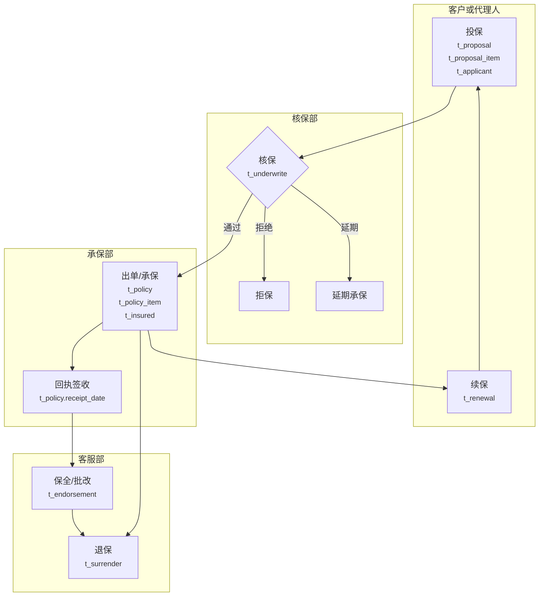
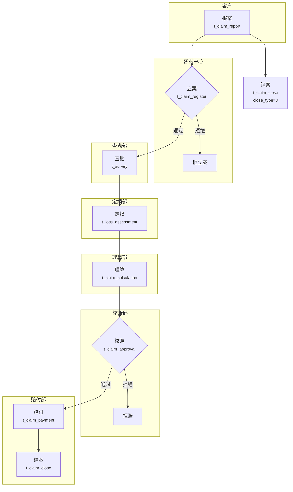

# Step 1: 业务板块与业务过程识别

## 目标

从业务系统的 DDL 表结构和采样数据中，识别出所有业务板块、业务过程，并绘制业务流程草图。

---

## 输入

| 输入项 | 必选 | 格式 | 说明 |
|-------|------|------|------|
| 表结构 DDL | 必选 | SQL 文本 / .sql 文件 | 所有业务表的 CREATE TABLE 语句 |
| 采样数据 | 推荐 | CSV / Markdown 表格 | 每表 10-20 条代表性数据 |

### 输入样例

#### 样例 A：表结构 DDL（必选）

用户直接粘贴或提供 .sql 文件：

```sql
CREATE TABLE t_policy (
  policy_id     BIGINT        COMMENT '保单ID，主键',
  policy_no     VARCHAR(32)   COMMENT '保单号，业务唯一标识',
  customer_id   BIGINT        COMMENT '客户ID，关联t_customer',
  product_id    BIGINT        COMMENT '产品ID，关联t_product',
  agent_id      BIGINT        COMMENT '代理人ID，关联t_agent',
  org_id        BIGINT        COMMENT '出单机构ID，关联t_organization',
  total_premium DECIMAL(18,2) COMMENT '总保费，单位：元',
  pay_mode      VARCHAR(10)   COMMENT '缴费方式：1-年缴 2-月缴 3-趸缴',
  status        VARCHAR(10)   COMMENT '保单状态：1-有效 2-失效 3-退保 4-满期 5-理赔终止',
  sign_date     DATE          COMMENT '签单日期',
  create_time   TIMESTAMP     COMMENT '记录创建时间'
) COMMENT '承保业务-保单主表';

CREATE TABLE t_claim_report (
  report_id     BIGINT        COMMENT '报案ID，主键',
  report_no     VARCHAR(32)   COMMENT '报案号',
  policy_id     BIGINT        COMMENT '保单ID，关联t_policy',
  customer_id   BIGINT        COMMENT '报案人客户ID',
  accident_date DATE          COMMENT '出险日期',
  accident_type VARCHAR(20)   COMMENT '出险类型：1-意外 2-疾病 3-身故',
  status        VARCHAR(10)   COMMENT '报案状态：0-待处理 1-已立案 2-拒立案 3-已销案',
  create_time   TIMESTAMP     COMMENT '记录创建时间'
) COMMENT '理赔业务-报案记录表';

-- ... 更多表 ...
```

完整 DDL 样例见 [examples/sample_ddl.sql](../examples/sample_ddl.sql)

#### 样例 B：采样数据（推荐）

##### t_policy 采样数据

| policy_id | policy_no | customer_id | product_id | agent_id | org_id | total_premium | pay_mode | status | sign_date |
|-----------|-----------|-------------|------------|----------|--------|---------------|----------|--------|-----------|
| 1001 | POL2025010001 | 5001 | 2001 | 4001 | 101 | 12000.00 | 1 | 1 | 2025-01-15 |
| 1002 | POL2025010002 | 5002 | 2003 | 4002 | 102 | 3600.00 | 2 | 1 | 2025-01-16 |
| 1003 | POL2025010003 | 5003 | 2001 | 4001 | 101 | 8500.00 | 1 | 3 | 2025-01-10 |
| 1004 | POL2025010004 | 5004 | 2002 | 4003 | 103 | 25000.00 | 3 | 1 | 2025-01-18 |
| 1005 | POL2025010005 | 5005 | 2004 | 4004 | 101 | 1200.00 | 1 | 2 | 2024-03-01 |
| 1006 | POL2025010006 | 5006 | 2001 | 4002 | 102 | 15000.00 | 1 | 4 | 2020-01-15 |

##### t_claim_report 采样数据

| report_id | report_no | policy_id | customer_id | accident_date | accident_type | status |
|-----------|-----------|-----------|-------------|---------------|---------------|--------|
| 2001 | RPT2025010001 | 1001 | 5001 | 2025-02-01 | 2 | 1 |
| 2002 | RPT2025010002 | 1002 | 5002 | 2025-02-05 | 1 | 1 |
| 2003 | RPT2025010003 | 1004 | 5004 | 2025-02-10 | 3 | 2 |
| 2004 | RPT2025010004 | 1006 | 5006 | 2025-02-15 | 1 | 0 |
| 2005 | RPT2025010005 | 1001 | 5001 | 2025-03-01 | 4 | 3 |

完整采样数据样例见 [examples/sample_data.md](../examples/sample_data.md)

---

## 产出文件

```
output/
└── 01-业务过程识别.md       # 表结构盘点 + 业务过程清单 + 业务流程全景图
```

---

## 执行步骤

### Step 1: 表结构盘点分类

**目标：** 对所有 DDL 表进行分类盘点，建立表结构全景视图。

**操作：**

1. **解析 DDL**：提取每张表的表名、表注释、字段名/类型/注释、主外键、分区字段

2. **初步分类**：
   - **按系统来源**：根据表名前缀 / 注释中的系统名称推断
   - **按表角色**：
     - 事实表候选：有明确时间戳 + 业务主键 + 度量字段（如 t_premium_receive）
     - 维度表候选：描述性属性为主 + 主键被其他表引用（如 t_customer）
     - 配置/码值表：数据量小、枚举值为主（如 t_code_config）
     - 日志/流水表：高频插入、时间序列特征明显

3. **标注置信度**：高 / 中 / 低
4. **标记异常表**：测试表（test_/tmp_）、系统表（sys_）、归档表（_bak/_history）

**产出样例：**

#### 表结构盘点

##### 统计概览
- 总表数：25 张
- 有效表：23 张（排除 t_code_config 配置表 1 张、t_region 公共维度表 1 张）
- 置信度分布：高 18 张 / 中 4 张 / 低 1 张
- 业务板块分布：承保 10 张 / 理赔 8 张 / 收付费 2 张 / 客户 3 张 / 产品 3 张 / 销管 3 张 / 公共 3 张

##### 承保板块

| 序号 | 表名 | 表注释 | 表角色 | 主键 | 核心字段 | 置信度 |
|-----|------|-------|-------|------|---------|-------|
| 1 | t_proposal | 投保单主表 | 事实表 | proposal_id | proposal_no, customer_id, premium, status | 高 |
| 2 | t_proposal_item | 投保单险种明细 | 事实明细 | item_id | proposal_id, risk_code, sum_insured | 高 |
| 3 | t_applicant | 投保人信息 | 维度表 | applicant_id | proposal_id, customer_id, name | 高 |
| 4 | t_underwrite | 核保记录 | 事实表 | uw_id | proposal_id, uw_result, uw_time | 高 |
| 5 | t_policy | 保单主表 | 事实/维度 | policy_id | policy_no, customer_id, total_premium, status | 高 |
| 6 | t_policy_item | 保单险种明细 | 事实明细 | item_id | policy_id, risk_code, premium | 高 |
| 7 | t_insured | 被保人信息 | 维度表 | insured_id | customer_id, policy_id, name | 高 |
| 8 | t_endorsement | 批单/保全 | 事实表 | endorsement_id | policy_id, endorse_type, endorse_premium | 高 |
| 9 | t_surrender | 退保记录 | 事实表 | surrender_id | policy_id, refund_amount, surrender_reason | 高 |
| 10 | t_renewal | 续保关系 | 事实表 | renewal_id | old_policy_id, new_policy_id | 高 |

##### 理赔板块

| 序号 | 表名 | 表注释 | 表角色 | 主键 | 核心字段 | 置信度 |
|-----|------|-------|-------|------|---------|-------|
| 11 | t_claim_report | 报案记录 | 事实表 | report_id | policy_id, accident_date, status | 高 |
| 12 | t_claim_register | 立案记录 | 事实表 | register_id | report_id, claim_case_no, estimated_amount | 高 |
| 13 | t_survey | 查勘记录 | 事实表 | survey_id | register_id, survey_date, survey_result | 高 |
| 14 | t_loss_assessment | 定损记录 | 事实表 | assessment_id | register_id, assess_amount | 高 |
| 15 | t_claim_calculation | 理算记录 | 事实表 | calc_id | register_id, calc_amount, deductible | 高 |
| 16 | t_claim_approval | 核赔审批 | 事实表 | approval_id | register_id, approval_result | 高 |
| 17 | t_claim_payment | 赔付记录 | 事实表 | payment_id | register_id, pay_amount, pay_method | 高 |
| 18 | t_claim_close | 结案记录 | 事实表 | close_id | register_id, final_amount, close_type | 高 |

##### 公共维度/配置表（不归入业务板块）

| 序号 | 表名 | 表注释 | 表角色 | 说明 |
|-----|------|-------|-------|------|
| 1 | t_customer | 客户主表 | 维度表 | 被多张事实表引用 |
| 2 | t_product | 产品主表 | 维度表 | 被承保/理赔/销管引用 |
| 3 | t_organization | 机构组织表 | 维度表 | 公共维度 |
| 4 | t_region | 行政区划表 | 维度表 | 公共维度 |
| 5 | t_code_config | 码值配置表 | 配置表 | 系统配置 |

##### 待确认表
| 表名 | 表注释 | 置信度 | 疑问 |
|-----|-------|-------|------|
| t_busi_log | 业务日志 | 低 ❓ | 不确定属于哪个板块，需确认是操作日志还是业务事件 |

### Step 2: 业务过程识别

**目标：** 从表结构中识别所有业务过程，明确类型和关联关系。

**操作：**

1. **识别业务过程类型**：
   - **事件型**：有明确时间戳、逐条增加、不可修改 → 如投保、报案
   - **状态型**：当前最新状态、定期刷新 → 如在保保单快照
   - **流程型**：多个事件串联 → 如投保→核保→出单
2. **推断状态流转**：查看 status 字段的采样值，推断状态含义和流转关系
3. **串联业务流程**：通过业务主键（policy_no、claim_case_no）关联不同表，通过时间字段确定先后顺序
4. **规范化命名**：中英文对照

**产出样例：**

#### 业务过程清单

##### 承保板块

| 序号 | 业务过程 | 英文名 | 类型 | 涉及表 | 关键时间字段 | 关键度量字段 | 置信度 |
|-----|---------|-------|------|-------|-------------|-------------|-------|
| 1 | 投保 | submit_proposal | 事件 | t_proposal, t_proposal_item, t_applicant | apply_time, create_time | premium（保费） | 高 |
| 2 | 核保 | underwrite | 事件 | t_underwrite | uw_time, create_time | — | 高 |
| 3 | 出单/承保 | issue_policy | 事件 | t_policy, t_policy_item, t_insured | sign_date, create_time | total_premium（总保费） | 高 |
| 4 | 回执签收 | receipt_confirm | 事件 | t_policy（receipt_date字段） | receipt_date | — | 中 |
| 5 | 批改/保全 | endorsement | 事件 | t_endorsement | apply_time, complete_time | endorse_premium（批退/批加保费） | 高 |
| 6 | 退保 | surrender | 事件 | t_surrender | apply_time, complete_time | refund_amount（退保金额） | 高 |
| 7 | 续保 | renewal | 事件 | t_renewal | renewal_date | — | 高 |

##### 理赔板块

| 序号 | 业务过程 | 英文名 | 类型 | 涉及表 | 关键时间字段 | 关键度量字段 | 置信度 |
|-----|---------|-------|------|-------|-------------|-------------|-------|
| 8 | 报案 | claim_report | 事件 | t_claim_report | report_date, create_time | — | 高 |
| 9 | 立案 | claim_register | 事件 | t_claim_register | register_date, create_time | estimated_amount（估损金额） | 高 |
| 10 | 查勘 | survey | 事件 | t_survey | survey_date, create_time | — | 高 |
| 11 | 定损 | loss_assessment | 事件 | t_loss_assessment | assess_date, create_time | assess_amount（定损金额） | 高 |
| 12 | 理算 | claim_calculation | 事件 | t_claim_calculation | calc_date, create_time | calc_amount（理算金额） | 高 |
| 13 | 核赔 | claim_approval | 事件 | t_claim_approval | approval_date, create_time | approval_amount（核赔金额） | 高 |
| 14 | 赔付 | claim_payment | 事件 | t_claim_payment | pay_date, create_time | pay_amount（赔付金额） | 高 |
| 15 | 结案 | claim_close | 事件 | t_claim_close | close_date, create_time | final_amount（最终赔付金额） | 高 |

##### 状态流转说明

###### t_policy 保单状态流转（基于采样数据推断）
| 状态值 | 含义 | 可流转至 | 推断依据 |
|-------|------|---------|---------|
| 1 | 有效 | 2(失效), 3(退保), 5(理赔终止) | COMMENT 明确列出 |
| 2 | 失效 | — | 终态 |
| 3 | 退保 | — | 终态，采样中 policy_id=1003 为退保 |
| 4 | 满期 | — | 终态，采样中 policy_id=1006 为满期 |
| 5 | 理赔终止 | — | 终态 |

###### t_claim_report 报案状态流转
| 状态值 | 含义 | 可流转至 | 推断依据 |
|-------|------|---------|---------|
| 0 | 待处理 | 1(已立案), 2(拒立案), 3(已销案) | COMMENT 明确列出 |
| 1 | 已立案 | — | 进入理赔流程 |
| 2 | 拒立案 | — | 终态 |
| 3 | 已销案 | — | 终态，采样中 report_id=2005 为已销案 |

###### t_surrender 退保状态流转
| 状态值 | 含义 | 可流转至 | 推断依据 |
|-------|------|---------|---------|
| 0 | 待审核 | 1(已完成), 2(已拒绝) | COMMENT 明确列出 |
| 1 | 已完成 | — | 终态 |
| 2 | 已拒绝 | — | 终态 |

### Step 3: 业务流程草图绘制

**目标：** 为每个业务板块绘制业务流程全景图。

**操作：**

1. 按板块组织业务过程
2. 用 mermaid `flowchart TB` + `subgraph` 语法绘制泳道图，按部门/角色划分泳道
3. 每个节点旁标注涉及的表名
4. 不确定的关联用 `❓` 标记

**产出样例：**

#### 承保板块

##### 流程描述
客户提交投保申请后，进入核保流程。核保通过则出单承保，保单生效后客户可进行保全/批改操作。
退保分为犹豫期退保和正常退保。保单到期后可续保，续保本质上是一次新的投保流程。

##### 流程图



##### 待确认项 ❓
| 序号 | 不确定内容 | 推断依据 | 需确认原因 |
|-----|----------|---------|-----------|
| 1 | 回执签收是否为独立流程节点？ | t_policy 表中仅有 receipt_date 字段，无独立表 | 可能只是保单的一个字段更新 |
| 2 | 退保后是否可撤销退保？ | 表中 status 只有 0/1/2 三种状态，未见"撤销退保"状态 | 可能存在线下流程 |
| 3 | 延期承保后是否可重新进入核保？ | 未见延期后的流转记录 | 需确认业务规则 |

---

#### 理赔板块

##### 流程描述
出险后客户报案，经立案审查通过后进入查勘、定损、理算流程。核赔通过后执行赔付并结案。
拒赔和销案为异常终态。

##### 流程图



##### 待确认项 ❓
| 序号 | 不确定内容 | 推断依据 | 需确认原因 |
|-----|----------|---------|-----------|
| 1 | 定损后是否可以补充定损？ | t_loss_assessment 有 status=2（需补充），但未见独立的补充定损表 | 可能在同一张表更新记录 |
| 2 | 查勘是否必须？是否所有案件都需要查勘？ | 所有理赔流程表都通过 register_id 关联，但查勘表可能为空 | 需确认小额免查勘规则 |
| 3 | 拒赔后是否可申诉重新核赔？ | 未见申诉相关表或字段 | 可能存在线下流程 |

---

## 置信度标记规范

| 置信度 | 定义 | 标记方式 | 后续处理 |
|-------|------|---------|---------|
| 高 | 表名+字段含义明确，AI 有充分把握 | 无特殊标记 | 直接使用 |
| 中 | 可推测但不确定 | 标注"中" | 需人工确认 |
| 低 | 无法判断 | 标注"低" + `❓` | 等人工补充 |

## 分批处理规则

当表数量较多（>30 张）时，按业务板块分批处理：

1. 先执行 Step 1 的盘点分类，确定业务板块划分
2. 按板块逐个执行 Step 2 和 Step 3
3. 每个板块处理完输出中间结果，供用户确认后继续
4. 所有板块处理完后汇总输出

## 注意事项

1. **不假设不存在的表或字段**：仅基于用户提供的 DDL 和采样数据推断
2. **标注推断依据**：每个业务过程的识别都要说明从哪些表/字段推断
3. **优先用采样数据验证**：表名/字段名不明确时，用采样数据辅助判断
4. **标记所有不确定项**：宁可多标 `❓`，也不给错误结论
